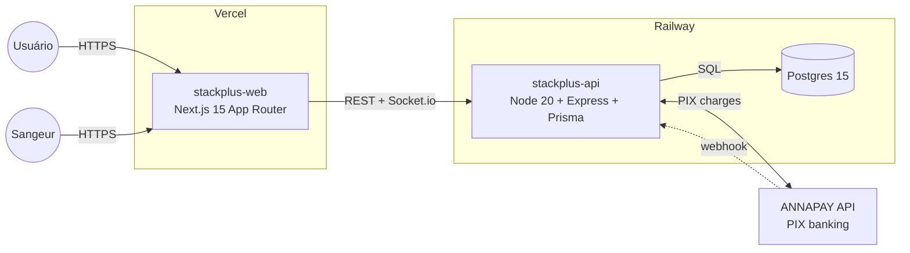
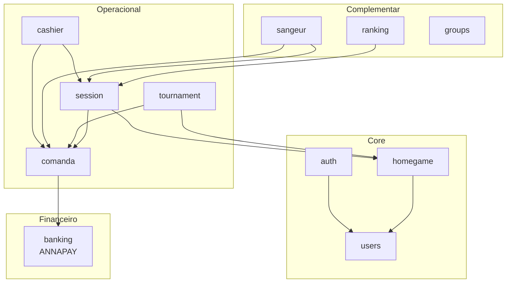
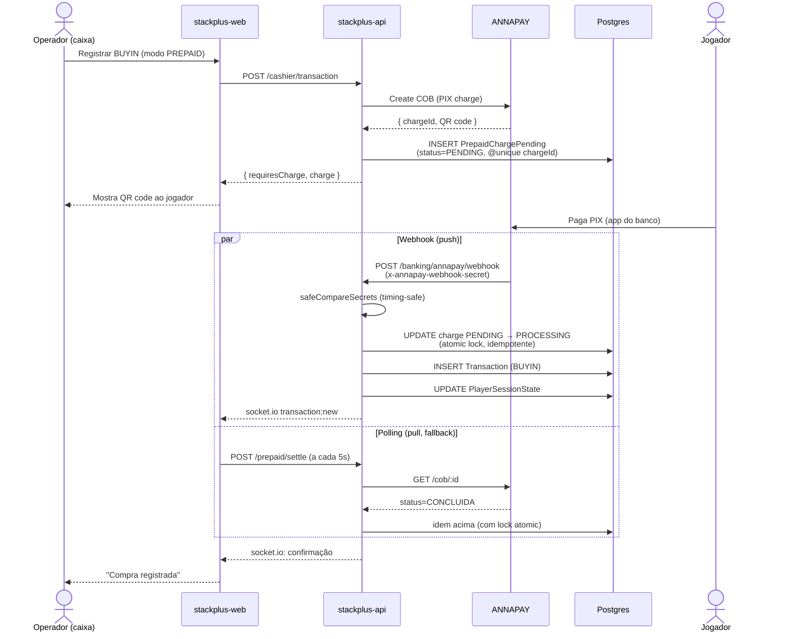
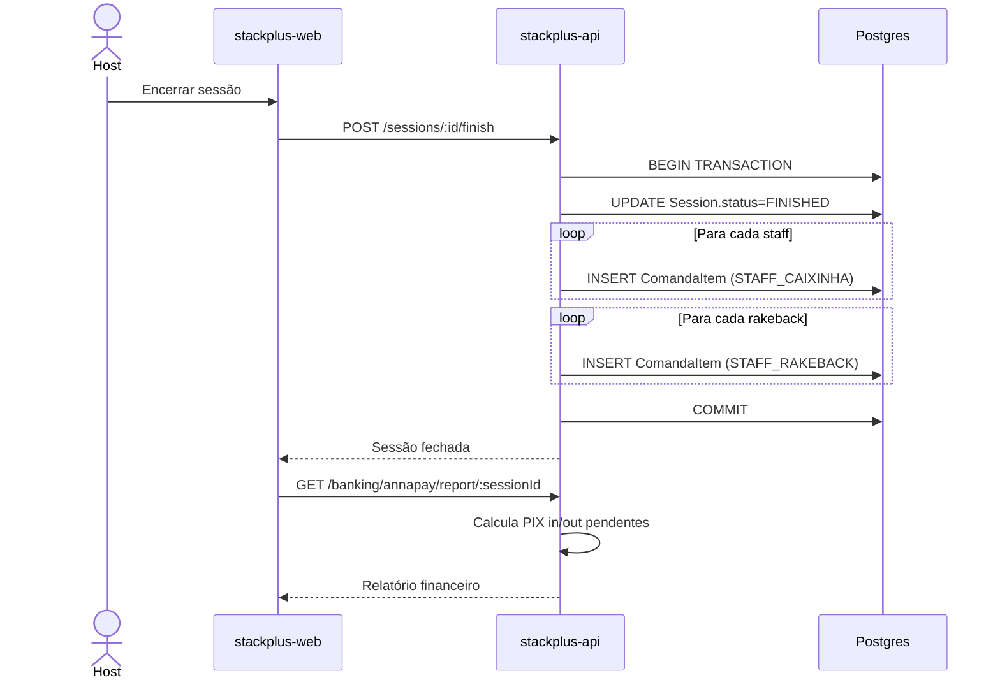
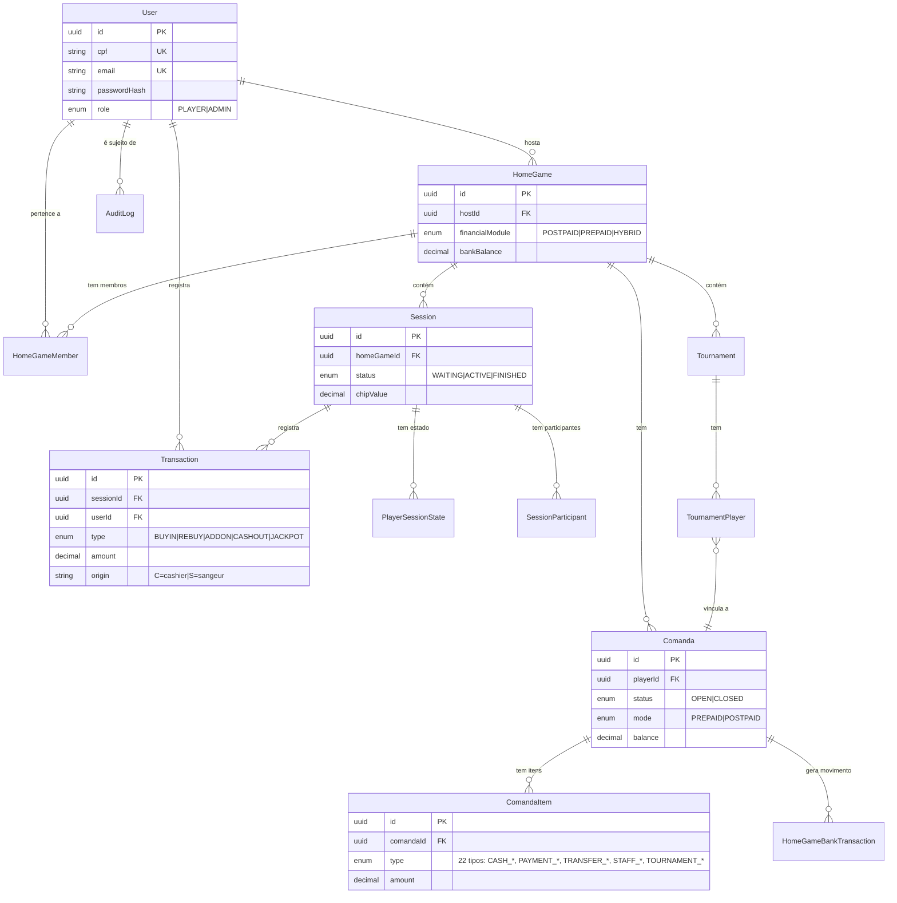

# StackPlus — Arquitetura

Visão geral do sistema, componentes, fluxos críticos e modelo de dados.
Diagramas em [Mermaid](https://mermaid.js.org/) — GitHub renderiza inline.

## Visão geral (deploy)

**Stack:**
- **Frontend**: Next.js 15 (App Router), React 18, TypeScript, Tailwind, Zustand, socket.io-client → deploy na Vercel
- **Backend**: Node 20, Express, Prisma 5, socket.io → deploy na Railway com Nixpacks
- **Database**: PostgreSQL 15+ (Railway managed)
- **Banking**: ANNAPAY (PIX in/out + webhook de liquidação)
- **Auth**: JWT single-token (refresh token pendente — ver SEC-004)
- **Observabilidade**: pino structured logs com `requestId` correlation

---

## Módulos do backend

Onde cada módulo está em `stackplus-api/src/modules/<nome>/`.

---

## Fluxo crítico: PIX prepaid (compra de ficha)

Cenário: home game em modo PREPAID — jogador paga via PIX antes de receber fichas.

**Pontos críticos de segurança (SEC-001, SEC-006):**
- Webhook valida secret com `crypto.timingSafeEqual` — mitiga timing attacks
- Sem header → 200 (healthcheck-friendly). Header errado → 401 + log warn
- UPDATE conditional `PENDING → PROCESSING` serve de lock atômico — webhook e polling concorrentes não geram double-settle
- `@unique chargeId` na `PrepaidChargePending` garante idempotência

---

## Fluxo crítico: fechamento de sessão (cash game)

---

## Modelo de dados (essencial)

**Principais enums:**
- `TransactionType`: BUYIN, REBUY, ADDON, CASHOUT, JACKPOT
- `ComandaItemType`: CASH_BUYIN, CASH_REBUY, CASH_ADDON, CASH_CASHOUT, TOURNAMENT_BUYIN, ..., PAYMENT_PIX_SPOT, PAYMENT_CASH, TRANSFER_IN, CARRY_IN, STAFF_CAIXINHA, STAFF_RAKEBACK, etc.
- `FinancialModule`: POSTPAID (fichas fiadas), PREPAID (paga antes), HYBRID (membro escolhe)

---

## Segurança & compliance

| Área | Estado | Onde |
|------|--------|------|
| JWT auth | ✅ | `src/middlewares/auth.middleware.ts` |
| Refresh token | ❌ pendente | SEC-004 |
| Rate limit (login/register) | ✅ | `src/middlewares/rate-limit.middleware.ts` |
| Webhook secret (ANNAPAY) | ✅ timing-safe | `src/modules/banking/annapay.controller.ts` |
| Idempotência de charge | ✅ atomic lock | `@unique chargeId` + UPDATE conditional |
| Audit log | ✅ | `src/lib/audit.ts` — DELETE tx/session/homegame, PIX out, role change |
| CPF/password rules | ✅ | `src/utils/password.ts` + checks no auth controller |
| Request correlation | ✅ | `pino-http` + `x-request-id` |

---

## Decisões arquiteturais não-óbvias

1. **Comanda como ledger universal** — toda movimentação financeira de um jogador (buy-in, cash-out, pagamento PIX, prêmio, rakeback, caixinha) vira um `ComandaItem`. Isso centraliza saldo e histórico num único lugar. O `Transaction` do caixa espelha o `ComandaItem` do buy-in pra preservar auditoria operacional.

2. **`Transaction.origin` em vez de FK direta pro registrador** — quando a DATA-001 Deploy A foi aplicada, o campo `registeredBy` passou a gravar `userId` puro, com o `origin` ('C' pra cashier, 'S' pra sangeur) indicando a rota. Isso evita precisar de polimorfismo/union types no Prisma. FK está bloqueada pelo Deploy B (aguardando estabilidade).

3. **PIX: webhook + polling** — ANNAPAY manda webhook, mas rede é não confiável. Polling a cada 5s pelo frontend serve de failsafe. O `UPDATE conditional PENDING→PROCESSING` como lock atômico impede double-settle mesmo quando os dois chegam juntos.

4. **Mount truncation workaround** — ver `docs/TRUNCATION-BUG.md`. Task #17 fechada mas bug de infra permanece intermitente; `scripts/check-truncation.ps1` é o guardião recomendado antes de commits.

---

## Links de referência

- `stackplus-api/prisma/schema.prisma` — schema completo (fonte da verdade do modelo)
- `stackplus-api/src/modules/banking/annapay.service.ts` — integração PIX completa
- `stackplus-api/src/modules/comanda/comanda.service.ts` — ledger engine
- `stackplus-api/tests/modules/` — testes de idempotência, reconciliação, rakeback
- `docs/TRUNCATION-BUG.md` — Task #17 (investigação do bug do mount)
